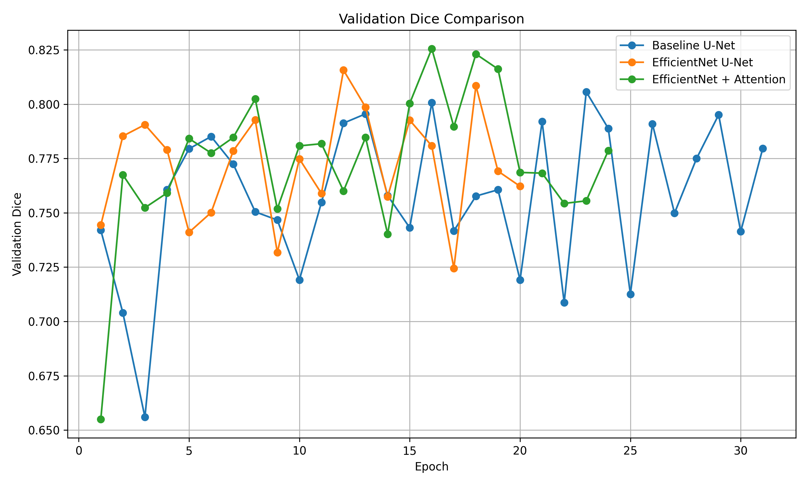
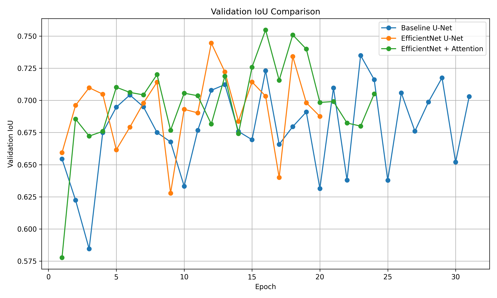
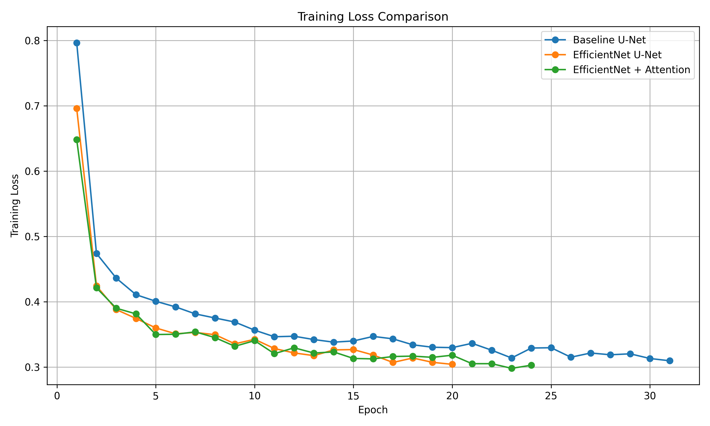
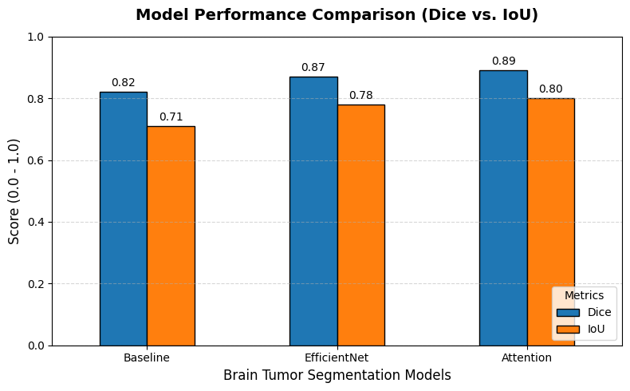
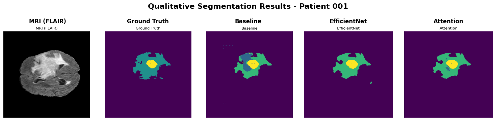
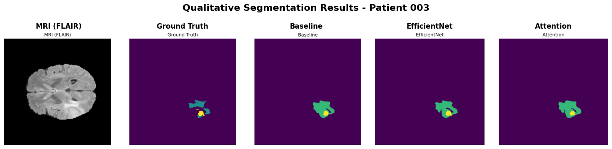

# Brain Tumor Segmentation using 3D U-Net Architectures

## Overview

This project presents a comparative study of deep learning architectures for automated brain tumor segmentation using the BraTS 2020 dataset. The objective is to accurately identify and segment tumor regions from multi-modal MRI scans while evaluating the trade-offs between segmentation performance, computational efficiency, and architectural complexity.

Three architectures were implemented and evaluated:

* Baseline 3D U-Net
* EfficientNet-Based 3D U-Net
* EfficientNet + Attention 3D U-Net

The models were developed using PyTorch and trained on volumetric MRI data using mixed-precision training, tumor-aware patch sampling, and hybrid Dice-CrossEntropy optimization.

---

## Dataset

### BraTS 2020 Dataset

The Brain Tumor Segmentation (BraTS) 2020 dataset contains multi-modal MRI scans of glioma patients along with expert-annotated tumor segmentation masks.

### MRI Modalities

* T1
* T1ce
* T2
* FLAIR

### Original Segmentation Labels

| Label | Description                         |
| ----- | ----------------------------------- |
| 0     | Background                          |
| 1     | Necrotic / Non-Enhancing Tumor Core |
| 2     | Peritumoral Edema                   |
| 4     | Enhancing Tumor                     |

### Remapped Training Classes

| Class ID | Description     |
| -------- | --------------- |
| 0        | Background      |
| 1        | Necrotic Core   |
| 2        | Edema           |
| 3        | Enhancing Tumor |

---

# Project Pipeline

## 1. Data Loading

* NIfTI (.nii.gz) volumes loaded using NiBabel
* Multi-modal MRI scans stacked into a 4-channel tensor
* Volumetric processing for 3D segmentation

## 2. Preprocessing

* Per-modality Z-score normalization
* Non-zero voxel normalization
* Label remapping
* Tumor-aware patch sampling
* Data quality filtering

## 3. Training

* Mixed Precision Training (AMP)
* Adam Optimizer
* Dice Loss + Cross Entropy Loss
* Early Stopping
* Model Checkpointing
* Validation Monitoring

---

# Model Architectures

## Baseline 3D U-Net

A standard encoder-decoder architecture consisting of:

* 3D Convolution Blocks
* Batch Normalization
* ReLU Activations
* Skip Connections
* Transposed Convolutions for Upsampling

### Advantages

* Strong segmentation baseline
* Proven medical imaging architecture
* Stable training behavior

---

## EfficientNet-Based 3D U-Net

The encoder was redesigned using EfficientNet-inspired MBConv blocks incorporating:

* Depthwise Separable 3D Convolutions
* Squeeze-and-Excitation (SE) Blocks
* Residual Connections
* Efficient Feature Extraction

### Advantages

* Reduced computational complexity
* Faster convergence
* Improved parameter efficiency
* Better feature representation

---

## EfficientNet + Attention 3D U-Net

This architecture extends the EfficientNet encoder by integrating attention mechanisms into the decoder pathway.

### Added Components

* Attention Gates
* Feature Refinement Modules
* Enhanced Skip Connections

### Goal

Improve localization of tumor regions by emphasizing clinically relevant features while suppressing irrelevant background information.

---

# Experimental Results

## Validation Performance

| Model                          | Best Validation Dice | Best Validation IoU |
| ------------------------------ | -------------------- | ------------------- |
| Baseline 3D U-Net              | 0.8057               | 0.7349              |
| EfficientNet U-Net             | 0.8157               | 0.7427              |
| EfficientNet + Attention U-Net | **0.8256**           | **0.7575**          |

---

# Training Curves

### Dice Score Comparison



### IoU Comparison



### Loss Comparison



---

# Model Performance Comparison



The comparison demonstrates a consistent improvement in segmentation performance as architectural enhancements are introduced.

---

# Qualitative Results

### Patient 1 Results



### Patient 2 Results



The figures present segmentation results for two representative patients from the validation set. For each patient, the visualization includes:

* MRI Slice (FLAIR modality)
* Ground Truth Annotation
* Baseline 3D U-Net Prediction
* EfficientNet U-Net Prediction
* EfficientNet + Attention U-Net Prediction

### Observations

* The Baseline U-Net successfully localizes the primary tumor regions but occasionally produces noisy boundaries and small false positive regions.
* The EfficientNet U-Net generates cleaner segmentation masks with improved localization and better separation of tumor structures from surrounding tissue.
* The EfficientNet + Attention U-Net produces the most refined tumor boundaries and demonstrates the closest agreement with the ground-truth annotations across both patients.
* Attention-guided feature refinement helps preserve fine tumor details while reducing background misclassifications.

The qualitative comparison supports the quantitative results, showing progressive improvements in segmentation quality from the Baseline model to the EfficientNet and Attention-enhanced architectures.

---

# Key Findings

## EfficientNet Improved Feature Extraction

Replacing the standard U-Net encoder with EfficientNet-inspired MBConv blocks improved both Dice and IoU scores while maintaining computational efficiency.

### Performance Gain

| Comparison               | Dice Improvement |
| ------------------------ | ---------------- |
| Baseline → EfficientNet  | +1.24%           |
| EfficientNet → Attention | +1.21%           |
| Baseline → Attention     | +2.47%           |

---

## Attention Mechanisms Achieved the Best Results

The EfficientNet + Attention U-Net achieved the highest validation performance:

* Dice Score: 0.8256
* IoU Score: 0.7575

Attention mechanisms improved feature refinement and tumor boundary delineation.

---

## EfficientNet Provided the Best Accuracy-to-Speed Trade-Off

Although the Attention model achieved the highest segmentation accuracy, the EfficientNet U-Net delivered competitive performance with lower computational overhead and faster convergence.

This makes EfficientNet U-Net attractive for practical deployment scenarios.

---

## Tumor-Aware Sampling Improved Learning Efficiency

Focusing training patches around tumor regions reduced background dominance and improved segmentation performance.

---

# Technologies Used

## Deep Learning

* PyTorch
* Torch AMP (Mixed Precision Training)

## Medical Imaging

* NiBabel
* NumPy

## Data Processing

* Pandas
* Scikit-Learn

## Visualization

* Matplotlib

---

# Repository Structure

```text
Brain-Tumor-Segmentation-BraTS2020/
│
├── notebooks/
│   ├── baseline_unet.ipynb
│   ├── efficientnet_unet.ipynb
│   └── attention_unet.ipynb
│
├── results/
│   ├── training_curves/
│   │   ├── dice_comparison.png
│   │   ├── iou_comparison.png
│   │   └── loss_comparison.png
│   │
│   ├── baseline_predictions.png
│   ├── efficientnet_predictions.png
│   ├── attention_predictions.png
│   ├── model_comparison.png
│   └── metrics/
│       └── model_comparison.csv
│
├── src/
│   ├── datasets/
│   ├── models/
│   ├── training/
│   └── evaluation/
│
├── README.md
├── requirements.txt
└── LICENSE
```

---

# Future Work

* Whole Tumor (WT) Evaluation
* Tumor Core (TC) Evaluation
* Enhancing Tumor (ET) Evaluation
* Learning Rate Scheduling
* CBAM Attention Modules
* Transformer-Based Segmentation Models
* SwinUNETR Experiments
* Full BraTS Benchmark Evaluation

---

# Author

**Shreyansh Shakya**

Computer Science Engineering Student

### Research Interests

* Medical AI
* Deep Learning
* Computer Vision
* Healthcare Analytics
* Agentic AI Systems

GitHub: https://github.com/ShreyanshShakya

LinkedIn: https://www.linkedin.com/in/shreyansh-shakya-3b019022a

---

## Citation

If you find this work useful, please consider starring the repository and citing the project.

```bibtex
@misc{shakya2025brainsegmentation,
  author = {Shreyansh Shakya},
  title = {Brain Tumor Segmentation using 3D U-Net Architectures},
  year = {2025},
  publisher = {GitHub},
  url = {https://github.com/ShreyanshShakya}
}
```
